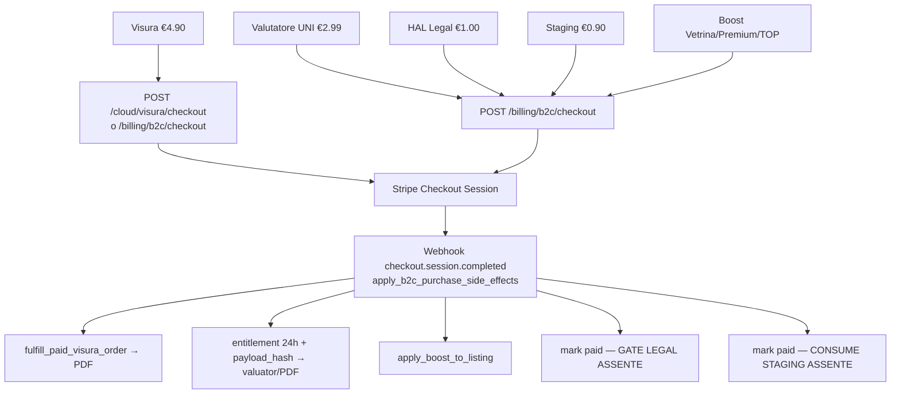

# Matrice Onda B — Analisi codice solo portale · 2026-10-08

**Onda**: B (anticipata su «vai» Founder; calendario D2 = 9 Ott)  
**Perimetro**: `frontend/src/apps/immocloud/**`, `apps/legal/**`, `backend/apps/immocloud/**`, `billing/b2c_*`, `al_legal` portal-facing  
**Esito**: mappa 1:1 + finding **P-009…P-017** · **nessun fix codice** (serve «vai» per item)

---

## B.0 Routes ImmocloudApp

| Path `/:lang/cloud/…` | FE entry |
|--|--|
| `` (index) | `pages/CloudHomePage.jsx` |
| `search` | `pages/CloudSearchPage.jsx` |
| `register` | `pages/CloudRegisterPage.jsx` |
| `property/:pid` | `components/PropertyDetailPage.jsx` |
| `account` | `components/AccountDashboard.jsx` |
| `account/sell` | `components/SellPage.jsx` |
| `valutatore` | `components/ValuatorPage.jsx` |
| `visura` | `components/VisuraPage.jsx` |
| `mutui` | `components/MutuiPage.jsx` |
| `checkout/success` | `components/CheckoutSuccessPage.jsx` |
| `checkout/cancel` | `components/CheckoutCancelPage.jsx` |

Fuori shell: `/:lang/{privacy,cookie,termini}` → `LegalDocPage`; `/:lang/legal` → `LegalApp` (ProtectedRoute).

---

## B.1 Modulo → files → endpoints → rischi

| Modulo | FE files | BE / endpoints | Mongo | Authz | Money / AI | Rischi / note |
|--|--|--|--|--|--|--|
| Home | `CloudHomePage`, `PropertyCard` | `GET /cloud/{facets,search,pulse}` | properties, agencies | anon | — | OK |
| Search | `CloudSearchPage`, `PropertyMapView` | `GET/POST /cloud/search*`, `GET /cloud/map`, MLS public | properties | anon; save → B2C | — | OK; near-me geoloc |
| Property | `PropertyDetailPage` | `GET /cloud/property/{pid}`, scout, favorites, videos, contact | properties, inquiries/leads | mix | Resend lead | contact PII; share URL |
| Account | `AccountDashboard` + shared security/notif | saved-searches, favorites, `/auth/me*` | favorites, saved_searches, users | B2C | — | no CTA “i miei annunci” |
| Sell | `SellPage`, PhotoUploader | `/cloud/me/properties*`, boosts, checkout | properties, b2c_purchases | B2C | boost/staging Stripe | private media URL → **P-009** |
| Valuator | `ValuatorPage`, AddressAutocomplete | `/cloud/valuator*`, `/billing/b2c/*` | usage, purchases, leads | login + email verify / UNI pay | UNI €2.99 | **P-012** dead `/cloud/login`; lang `/it/` |
| Visura | `VisuraPage` | `/cloud/visura/*` | visura_orders, purchases | JWT pay/download | €4.90 + OpenAPI | **P-014** `?next=`; **P-015** session_id URL |
| Mutui | `MutuiPage` → `MortgageComparator` | `/cloud/mutui/{config,compare,plan,lead}` | mortgage_leads | anon | free lead | **P-016** gdpr hardcoded |
| Legal HAL | `apps/legal/LegalApp.jsx` | `/app/legal/{chat,analyze-pdf,sessions}` | al_legal_* | JWT any role | catalog €1 **non gateato** | **P-010** unpaid Legal |
| Auth register | `CloudRegisterPage` | `POST /cloud/auth/register` | users | anon | — | **P-014** next ignorato |
| Checkout | success/cancel pages | `GET /billing/b2c/status/{sid}` | b2c_purchases | cookie+sid | — | **P-015** sid URL; lang `/it/` |
| TopNav/Footer | `CloudTopNav`, `FooterB2C` | — | — | — | — | **P-013** Vendi→register; **P-017** no mobile nav |
| Media | (FE img src) | `GET /api/media/{path}` | object store | **public** (salvo fascicolo/modulistica) | — | **P-009** `omnia/private/` 200 |
| Billing B2C | Sell/Valuator/Visura CTAs | `/billing/b2c/checkout`, webhook | b2c_purchases | JWT | boost/UNI/visura/legal/staging | **P-011** staging/legal ledger-only |

---

## B.2 Checklist moduli (sintesi)

| Check | Home | Search | Property | Account | Sell | Valuator | Visura | Mutui | Legal | Auth | Checkout |
|--|--|--|--|--|--|--|--|--|--|--|--|
| FE entry | ✅ | ✅ | ✅ | ✅ | ✅ | ✅ | ✅ | ✅ | ✅ | ✅ | ✅ |
| Endpoints mappati | ✅ | ✅ | ✅ | ✅ | ✅ | ✅ | ✅ | ✅ | ✅ | ✅ | ✅ |
| Mongo | ✅ | ✅ | ✅ | ✅ | ✅ | ✅ | ✅ | ✅ | ✅ | ✅ | ✅ |
| Authz chiara | ✅ | ✅ | ✅ | ✅ | ✅ | ⚠ login broken | ⚠ next | ✅ | ⚠ no pay | ✅ | ✅ |
| Stripe keys | — | — | — | — | boost | UNI | visura | — | legal gap | — | status |
| AI/provider | — | — | scout/video | — | improve | Nominatim | OpenAPI | — | Gemini+Tavily | — | — |
| Error UX | swallow | OK | console.error | OK | OK | OK | OK | OK | OK | OK | poll |
| data-testid | buoni | buoni | buoni | gap fav | densi | buoni | buoni | shared | buoni | buoni | buoni |
| Dead/TODO | — | — | — | stale comment | — | **login** | next | — | — | push disabled | — |
| Security | — | — | PII contact | erase | **media** | bypass agent | sid URL | gdpr | unpaid+audit | — | sid URL |

---

## B.3 Flussi soldi B2C (mermaid)

---

## B.4 Finding Onda B (indice)

| ID | Sev | Titolo |
|--|--|--|
| P-009 | **P0** | Media `omnia/private/…` pubblici via `GET /api/media/...` |
| P-010 | **P1** | HAL Legal B2C senza gate pagamento (SKU €1 esiste) |
| P-011 | **P2** | `b2c_staging_render` paid senza consume path |
| P-012 | **P2** | Valuator link `/it/cloud/login` inesistente + lang hardcode |
| P-013 | **P2** | TopNav «Vendi» → sempre register (anche se B2C loggato) |
| P-014 | **P2** | Register ignora `?next=` (Visura/Valuator) |
| P-015 | **P2** | `session_id` Stripe in query URL (Visura/Checkout) |
| P-016 | **P3** | Mutui lead: `gdpr_consent: true` hardcoded FE |
| P-017 | **P3** | CloudTopNav senza menu mobile |

Dettaglio in `docs/audit/portale-finding.md`.

---

## Chiusura Onda B
- [x] Tabella modulo → files → endpoints → rischi  
- [x] Finding codice P-009…P-017  
- [x] Mermaid flussi soldi B2C  
- [x] Fix P-009…P-010 + P-012…P-017 (vai Founder)  
- [ ] P-011 staging — ancora aperto  
